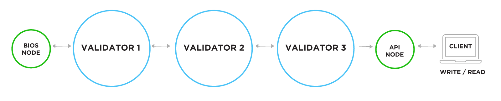

# Containerized Node Definitions & Network Boot Sequence

<p align="center">
  
</p>

<center>

[](https://standardjs.com)    

</center>


## About This Project:

This collection of scripts launches a local EOSIO network with multiple node configurations. There is also an automated boot sequence that utilizes a temporary "bios" node to launch the chain, deploy system contracts and set a schedule with three active block producer nodes. 

This project can be useful as a development environment for system contracts.



### Version

- 0.1.0

## Installation
Basic knowledge about Docker, Docker Compose, and Shell Script is required.

### Before to start

Some things you need before getting started:

- [jq](https://stedolan.github.io/jq/download/)
- [make](https://en.wikipedia.org/wiki/Make_(software))
- [docker](https://www.docker.com/)

### First time run

1.  Clone this repo using `git clone --depth=1 https://github.com/eoscostarica/eosio-network-bootstrap.git <YOUR_PROJECT_NAME>`
2.  Move to the appropriate directory: `cd <YOUR_PROJECT_NAME>`.
3.  Set the environment variables  `EOS_PUB_KEY` & `EOS_PRIV_KEY`
4.  Enter command `make run`

### Quick start

Once installed you can run `make run`, you can check the services running on:

- `api-node` at [http://localhost/v1/chain/get_info](http://localhost/v1/chain/get_info)


### File Structure

Within the download you'll find the following directories and files


```
.
├── Dockerfile ........................... Docker File
├── docker-compose.yml ................... Docker Compose
├── makefile ............................. Makefile
├── services ............................. Node configurations
│ ├── api-node ........................... API node (other node have same structure)
│ | ├── config.ini ....................... Nodeos Configuration File
│ | ├── genesis.json ..................... Genesis JSON (must be the same for other nodes)
│ | └── start.sh ......................... Script to start node with config params
│ ├── bios ............................... Temporary Bios Node Configuration
│ | ├── config.ini ....................... Nodeos Configuration File
│ | ├── genesis.json ..................... Genesis JSON (must be the same for other nodes)
│ | ├── start.sh ......................... Script to start node with config params
│ | └──  utils ........................... Boot process specific scripts
│ │   ├── bios.sh ........................ Boot sequence script
│ │   ├── schedule.json .................. Block Producer Schedule to propose
│ |   └── vault.sh ....................... Vault script for secure key storage
│ ├── vault .............................. Vault Service
│ | └── config ........................... Valut Configuration
│ │   └── vault.json ..................... Valut Configuration
│ └── wallet ............................. KEOSD Wallet Service
│   └──  start.sh ........................ Wallet Start Script
├── kubernetes/ .......................... Kubernetes Definitions Dir
├── mkutils/ ............................. Make Utils
└── README.md ............................ This File
```
### Features

#### Vault

After the pod for the vault has been initiated, make sure you do:

- Make a port-forward to the vault.
- Make sure you set an environment variable called VAULT_URL with the url from the port-forward.
- `source services/bios/utils/vault.sh` and call the `init` function passing the path where you want to to store the keys file `init vault_keys.json` which should not only create the keys but unseal the vault and leave it ready to store and serve secrets


## Contributing

Please Read EOS Costa Rica's [Open Source Contributing Guidelines](https://guide.eoscostarica.io/docs/open-source-guidelines).

Please report bugs big and small by [opening an issue](https://github.com/eoscostarica/eosio-network-bootstrap/issues)

### Contributors

Thanks goes to these wonderful people who support this project!

<!-- ALL-CONTRIBUTORS-LIST:START - Do not remove or modify this section -->
<!-- prettier-ignore-start -->
<!-- markdownlint-disable -->
<table>
  <tr>
    <td align="center"><a href="https://github.com/danazkari"><br /><sub><b>Daniel Prado</b></sub></a><br /><a href="https://github.com/eoscostarica/blockchain-nodes/commits?author=danazkari" title="Code">💻</a> <a href="#infra-danazkari" title="Infrastructure (Hosting, Build-Tools, etc)">🚇</a></td>
    <td align="center"><a href="https://eoscostarica.io/"><br /><sub><b>Xavier Fernandez</b></sub></a><br /><a href="https://github.com/eoscostarica/blockchain-nodes/commits?author=xavier506" title="Code">💻</a> <a href="https://github.com/eoscostarica/blockchain-nodes/commits?author=xavier506" title="Documentation">📖</a> <a href="#ideas-xavier506" title="Ideas, Planning, & Feedback">🤔</a></td>
  </tr>
</table>

<!-- markdownlint-restore -->
<!-- prettier-ignore-end -->
<!-- ALL-CONTRIBUTORS-LIST:END -->

## License

GNU GPLv3 © [EOS Costa Rica](https://eoscostarica.io)

## About EOS Costa Rica

<p align="center">
  <a href="https://eoscostarica.io">
    
  </a>
</p>
<br/>

EOS Costa Rica is an independently-owned, self-funded, bare-metal Genesis EOS block producer that develops solution using EOSIO and provides infrastructure for EOSIO blockchains. We support open source software for our community while offering enterprise solutions and custom blockchain development for our clients.

[eoscostarica.io](https://eoscostarica.io) 
